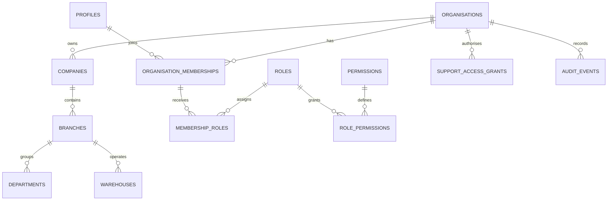

# Database Design

## Core hierarchy

`platform -> organisation -> company -> branch -> department / warehouse`

`profiles` is keyed by `auth.users.id`. `organisation_memberships` establishes a user's tenant membership. Role assignments and scope assignments determine the member's effective permissions.

## Rules

- Every tenant-owned business record includes `organisation_id`.
- Company, branch, department and warehouse records include their parent IDs and composite unique keys that support tenant-consistent foreign keys.
- Timestamps use `timestamptz`; IDs use UUIDs; money will use integer minor units or documented `numeric` scale, never JavaScript floating point.
- Tenant state is explicit. Suspended organisations cannot create new transactional records in later phases.
- Audit records are append-only to ordinary users.

## Platform provisioning tables

The baseline includes organisations, companies, branches, departments, warehouses, profiles, memberships, roles, permissions, role permissions, member roles, member scopes, platform role assignments, support access grants, audit events, modules, plans, plan limits, plan modules, subscriptions, implementation projects, shared currencies, organisation exchange-rate versions, tax-configuration versions, business-party categories, business parties, party contacts, party addresses, item categories, units of measure, unit conversions, catalogue items, and item barcodes.

`platform_role_assignments` is separate from tenant membership because platform staff must not receive tenant membership merely to administer the platform. `provision_organisation(jsonb)` is a security-definer function that checks a platform permission internally and atomically creates the tenant root, first company, first branch, owner membership/scope/role, implementation record, and audit event.

## Current Phase 1 commands

Audited, permission-checked commands now cover tenant lifecycle, subscription plans and assignment, implementation stages, structure creation, membership/scope assignment, custom-role creation, support-access grant/revocation, and audit-trail visibility. Assigned plan limits are checked inside resource-creation and membership commands rather than only in the user interface.

## Phase 2 Localisation Foundation

`currencies` is platform-managed reference data. `organisation_exchange_rate_versions` and `tax_configuration_versions` are tenant-owned, RLS-protected append-only configuration versions. Both carry effective dates, source references, draft/approved/retired state, actor references, and audit events. Approval retires an approved record for the same effective key before it promotes the selected draft, preserving historical versions without hard-coding statutory rates.

`business_parties` stores a tenant's customer, supplier, or shared party identity. Categories, contacts, and addresses each duplicate `organisation_id` and use composite foreign keys to the party, preventing cross-tenant child records at the database boundary. Primary contact and primary address selections are constrained with partial unique indexes.

## Phase 2 Item Catalogue

`catalog_items` separates product and service identity from future inventory balances. Each item has a tenant-scoped code, category, and base unit; products may opt into future inventory tracking, while services cannot. Categories, units, conversions, and barcodes all carry `organisation_id`; composite foreign keys prevent cross-tenant links, compatible unit dimensions are checked in the command, and a partial unique index ensures at most one primary barcode per item.
