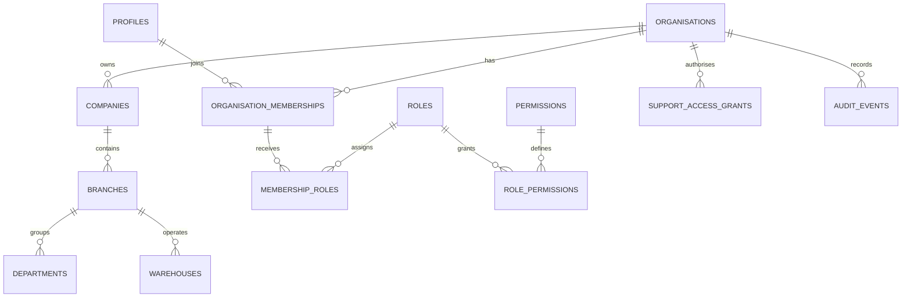

# Database Design

## Core hierarchy

`platform -> organisation -> company -> branch -> department / warehouse`

`profiles` is keyed by `auth.users.id`. `organisation_memberships` establishes a user's tenant membership. Role assignments and scope assignments determine the member's effective permissions.

## Rules

- Every tenant-owned business record includes `organisation_id`.
- Company, branch, department and warehouse records include their parent IDs and composite unique keys that support tenant-consistent foreign keys.
- Timestamps use `timestamptz`; IDs use UUIDs; money will use integer minor units or documented `numeric` scale, never JavaScript floating point.
- Tenant state is explicit. Suspended organisations cannot create new transactional records in later phases.
- Audit records are append-only to ordinary users.

## Platform provisioning tables

The baseline includes organisations, companies, branches, departments, warehouses, profiles, memberships, roles, permissions, role permissions, member roles, member scopes, platform role assignments, support access grants, audit events, modules, plans, plan modules, subscriptions, and implementation projects.

`platform_role_assignments` is separate from tenant membership because platform staff must not receive tenant membership merely to administer the platform. `provision_organisation(jsonb)` is a security-definer function that checks a platform permission internally and atomically creates the tenant root, first company, first branch, owner membership/scope/role, implementation record, and audit event.
